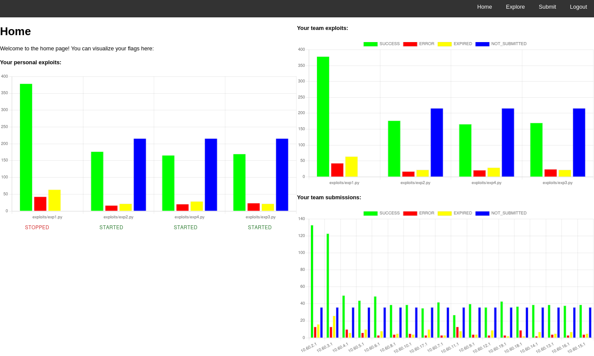
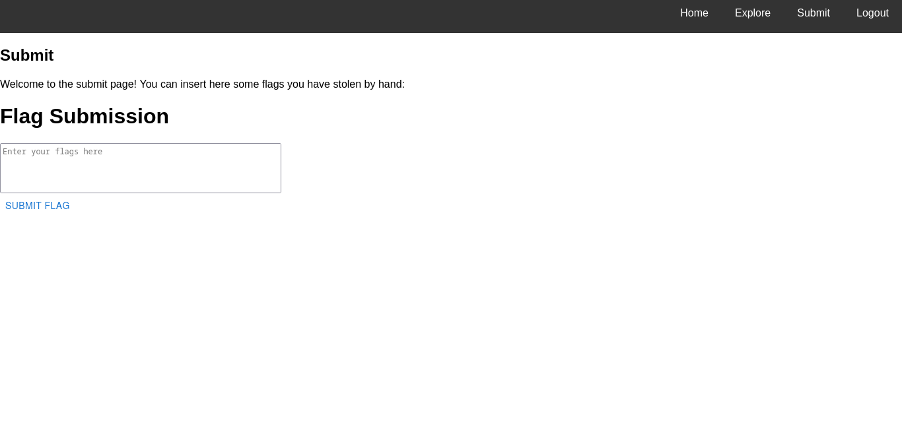

# flagSubmitter
Flag submission system for Attack/Defense CTFs.

* [Server](#server)
    * [Installation](#installation)
    * [Configuration](#configuration)
    * [Usage](#usage)
* [Client](#client)
* [Screenshots](#screenshots)

## Server
The server is a go web application that uses SQLite as its database engine: It receives flags stolen by the team members and sends them
periodically to the checksystem provided by the game organizators. It also allows users to retrieve some useful data from the database.

### Installation
First of all, you should clone the repository
```
git clone https://github.com/dagus01-lab/flagSubmitter.git
```
Then, you should install all the required dependencies for the go web application
```
cd ./flagSubmitter
go mod download
```
Finally, you should install all the required dependencies to run the frontend 
```
cd ./server/frontend
npm install
npx webpack --config webpack.config.js
```
### Configuration
It is possible to give the flagSubmitter a .yaml file for configuration, and if it is not provided, 
the file [config.yaml](server/backend/config.yaml) is chosen. The configuration file should have this structure:

 ```yaml
 serverConf:
  sessionLifetime : session-duration # in seconds
  database : database-instance-file # path to the database instance file
  clientPort : client-port # the port on which clients listen for exploits to start/stop
  apiToken : token
gameConf:
  numberTeams : number_teams # number of teams
  teamFormat : team_format # the ip addresses of the teams in the competition, expressed with a wildcard
  wildcard : wildcard # the wildcard character contained into the teamFormat parameter
  teamIP : team_ip # the ip address of your team
  teamToken : team_token # token associated to your team
  nopTeam : nop_team_ip
  roundDuration : round_duration # in seconds
  flagFormat : flag_format # regex representing the flag format
  flagIDurl : flagIDurl # flag ids endpoint. Leave blank if none
  flagAlive : flag_alive # number of rounds afte which a flag is considered to be old
submissionConf:
  subProtocol : submission_protocol # gameserver submission protocol. For the time being, it can be "ccit" or "dummy"
  subLimit : submission_limit # maximum number of submissions per round
  subInterval : submission_interval # minimum interval of time after which the server must perform a new flag submission to the database
  subPayloadSize : submission_payload_size # maximum size of submission payload
  subUrl : submission_url # the url to the flag checksystem
  dbnsub : db_nsub # string representing flags that have not been submitted yet within the local database
  dbsub : db_sub # string representing flags that have been submitted within the local database
  dbsucc : db_succ # string representing correct flags within the local database
  dberr : db_err # string representing incorrect flags within the local database
  dbexp : db_exp # string representing expired flags within the local database
authConf:
  webPassword : password # password that is asked on login in case authentication is not enabled
  authEnable: boolean # determines whether authentication is enabled or not
  users: [{"username", "password"},...] # a list of users in case authentication is enabled
 ```

### Usage
The backend needs to be compiled before execution
```
cd backend
go build
./backend -f CONF_FILE
```
The web interface can be accessed by default on port 5000. To log in, use any username and the password you set.

In case of wrong credentials users will be notified and asked to enter the correct username and password


## Client
```
cd client
go build
./client -s SERVER_URL -u USERNAME -t TOKEN -d ./exploits_dir/ -n THREADS
```
The client is a go program that runs all the programs in the directory specified by the user.
Firstly the client fetches the configuration from the server. Then it reads the standard output of every
script, extracts the flags using the regex provided in the server configurations, and sends them to the 
server. 
Moreover the client listens on a specific port, in order to allow the server to stop/restart some of the
exploits that are in the specified directory

## Screenshots




### REMEMBER

- Attack scripts must have coherent names
- Attack scripts must have shebang at the beginning
- Attack scripts must be executable
- Set
    - `team`
    - `flagFormat`
    - `subUrl`
    - Strings of verification messages if necessary
